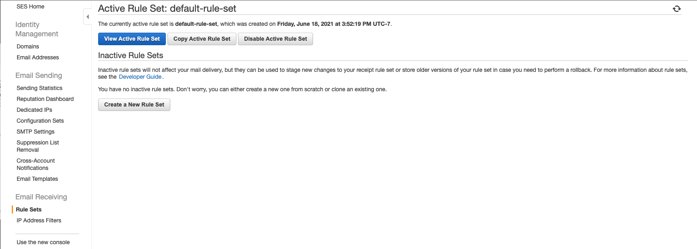

# AWS SES Email Forwarder

## Summary

This is a Cloudformation stack that creates a Lambda function, an s3 bucket, and associated roles to allow interaction between Lambda, S3, and SES. The Cloudformation stack makes an application that does the following:

- triggers the Lambda function on object upload to the S3 bucket
- the Lambda function loads the object from S3 - if the object is not an email file, the function will return an error
- the Lambda function uses the `mailparser` library's `simpleParser` exported function to parse the email
- the Lambda function calls the AWS SDK's `ses.sendMail` function to forward the email to a specified forwarding address

This repo was trimmed and modified from [AWS's Example Serverless App](https://github.com/aws-samples/ses-auto-forward-by-language).

**This will only work in the us-east-1 region unless you've moved out of the SES sandbox (if you don't know what this is, just deploy to us-east-1)**

The repo contains the following items:
- `src` - Code for the application's Lambda function.
- `events` - Invocation events that you can use to invoke the function.
- `__tests__` - Unit tests for the application code. 
- `template.yml` - A template that defines the application's AWS resources.

Resources for this project are defined in the `template.yml` file in this project. You can update the template to add AWS resources through the same deployment process that updates your application code.

## Prerequisites

**Having a verified domain and a verified forwarding address are prerequisites for forwarding email sent to your verified domain.** 
- See [AWS's SES documentation for details on verifying a domain](https://docs.aws.amazon.com/ses/latest/DeveloperGuide/receiving-email-getting-started-verify.html). 
- *Note: verifying is a 1-click process if you've purchased/registered the domain through AWS's Route 53 DNS services.*

You will need to provide a `fromEmailAddress` and a `toEmailAddress` during the deployment process. The `fromEmailAddress` can be any address for your verified domain (such as `donotreply@verifieddomain.tld`). The `toEmailAddress` must be a verified address, and it should be the inbox where you will monitor the forwarded mail.

## Deploy the sample application

The AWS SAM CLI is an extension of the AWS CLI that adds functionality for building and testing Lambda applications. It uses Docker to run your functions in an Amazon Linux environment that matches Lambda. It can also emulate your application's build environment and API.

To use the AWS SAM CLI, you need the following tools:

* AWS SAM CLI - [Install the AWS SAM CLI](https://docs.aws.amazon.com/serverless-application-model/latest/developerguide/serverless-sam-cli-install.html).
* Node.js - [Install Node.js 14](https://nodejs.org/en/), including the npm package management tool.
* Docker - [Install Docker community edition](https://hub.docker.com/search/?type=edition&offering=community).

To build and deploy your application for the first time, run the following in your shell:

```bash
sam build
sam deploy --guided
```

The first command will build the source of your application. The second command will package and deploy your application to AWS, with a series of prompts:

* **Stack Name**: The name of the stack to deploy to CloudFormation. This should be unique to your account and region, and a good starting point would be something matching your project name.
* **AWS Region**: The AWS region you want to deploy your app to.
* **Parameter AppBucketName**: This template includes a parameter to name the S3 bucket you will create as a part of the new application. This name needs to be globally unique.
* **Confirm changes before deploy**: If set to yes, any change sets will be shown to you before execution for manual review. If set to no, the AWS SAM CLI will automatically deploy application changes.
* **Allow SAM CLI IAM role creation**: Many AWS SAM templates, including this example, create AWS IAM roles required for the AWS Lambda function(s) included to access AWS services. By default, these are scoped down to minimum required permissions. To deploy an AWS CloudFormation stack which creates or modifies IAM roles, the `CAPABILITY_IAM` value for `capabilities` must be provided. If permission isn't provided through this prompt, to deploy this example you must explicitly pass `--capabilities CAPABILITY_IAM` to the `sam deploy` command.
* **Save arguments to samconfig.toml**: If set to yes, your choices will be saved to a configuration file inside the project, so that in the future you can just re-run `sam deploy` without parameters to deploy changes to your application.

## Configure Receiving Rule in SES

**As mentioned above, you must already have an SES-verified domain in `us-east-1` before you can set up a Receiving Rule for that domain. See [AWS's SES documentation for details on verifying a domain](https://docs.aws.amazon.com/ses/latest/DeveloperGuide/receiving-email-getting-started-verify.html). 

After the Cloudformation application stack is successfully deployed, do the following:
1. Log into your AWS console and open your SES configuration home page

2. Add a rule - you can create a new rule set or add the rule to an active set


3. Add recipient(s) - to catch all email to the verified domain, use `'verifieddomain.tld'` (`i.e. 'example.com'). To catch mail to a subdomain, use `'subdomain.verifieddomain.tld'`.


4. Add an S3 Action - be sure to select the s3 bucket that was deployed as part of your Cloudformation stack. You do not need to set a prefix or SNS topic. Encryption is up to you, but beyond the scope of this guide.


5. Add Rule Details - add a name and choose whether you want to require TLS and/or spam/virus scanning. Also be sure to add the rule to an active rule set (such as the default set).


6. Review and deploy!

You should now be able to send email to your verified domain, and the email will be forwarded to a verified email address that you specified during the Cloudformation stack deployment.

## Additional Details 

### Use the AWS SAM CLI to build and test locally

Build your application by using the `sam build` command.

```bash
my-application$ sam build
```

The AWS SAM CLI installs dependencies that are defined in `package.json`, creates a deployment package, and saves it in the `.aws-sam/build` folder.

Test a single function by invoking it directly with a test event. An event is a JSON document that represents the input that the function receives from the event source. Test events are included in the `events` folder in this project.

Run functions locally and invoke them with the `sam local invoke` command. See more with `sam local invoke --help`.

In order for the function to execute, it must have the proper resources to be able to read real email data from s3 and send real emails with SES. Modify the `events/s3.json` and `env.json` files to reflect S3 data that exists and email address that you've verified with AWS SES.

```bash
my-application$ sam local invoke handler --event events/s3.json --env-vars env.json
```

**Note: if deployment fails, you will need to manually delete the application stack from Cloudformation via the AWS console.**

Open the [**Applications**](https://console.aws.amazon.com/lambda/home#/applications) page of the Lambda console, and choose your application. When the deployment completes, view the application resources on the **Overview** tab to see the new resource. Then, choose the function to see the updated configuration that specifies the dead-letter queue.

### Fetch, tail, and filter Lambda function logs

To simplify troubleshooting, the AWS SAM CLI has a command called `sam logs`. `sam logs` lets you fetch logs that are generated by your Lambda function from the command line. In addition to printing the logs on the terminal, this command has several nifty features to help you quickly find the bug.

**NOTE:** This command works for all Lambda functions, not just the ones you deploy using AWS SAM. Be sure to use your custom stack name if you did not accept the default name `sam-app`

```bash
my-application$ sam logs -n SesEmailForwardingFunction --stack-name sam-app --tail
```

**NOTE:** This uses the logical name of the function within the stack. This is the correct name to use when searching logs inside an AWS Lambda function within a CloudFormation stack, even if the deployed function name varies due to CloudFormation's unique resource name generation.

You can find more information and examples about filtering Lambda function logs in the [AWS SAM CLI documentation](https://docs.aws.amazon.com/serverless-application-model/latest/developerguide/serverless-sam-cli-logging.html).

### Unit tests

Tests are defined in the `__tests__` folder in this project. Use `npm` to install the [Jest test framework](https://jestjs.io/) and run unit tests.

```bash
my-application$ npm install
my-application$ npm run test
```

### Cleanup

To delete the sample application that you created, use the AWS CLI. Assuming you used your project name for the stack name, you can run the following:

```bash
aws cloudformation delete-stack --stack-name sam-app
```

### Resources

For an introduction to the AWS SAM specification, the AWS SAM CLI, and serverless application concepts, see the [AWS SAM Developer Guide](https://docs.aws.amazon.com/serverless-application-model/latest/developerguide/what-is-sam.html).

Next, you can use the AWS Serverless Application Repository to deploy ready-to-use apps that go beyond Hello World samples and learn how authors developed their applications. For more information, see the [AWS Serverless Application Repository main page](https://aws.amazon.com/serverless/serverlessrepo/) and the [AWS Serverless Application Repository Developer Guide](https://docs.aws.amazon.com/serverlessrepo/latest/devguide/what-is-serverlessrepo.html).
